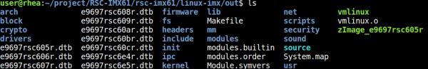
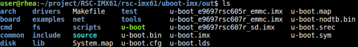

# ACP-IMX6POS Yocto

## Build and install Yocto image for ACP-IMX6POS

Here you can find instruction to setup development environment for Yocto source code for ACP-IMX6POS and the way to install it on eMMC. With this guideline, user will be able to setup the system easily and test all the functions with the system.  

### Setup Build Environment

The recommended minimum Ubuntu version is 14.04 but builds for Jethro works on 12.04 or later.Earlier versions maycause the Yocto Project build setup to fail, because it requires python versions only available starting wtih Ubuntu 12.04.A Yocto Project build requires that some packages be installed for the build that are documented under the Yocto Project.  

Essential Yocto Project host packages are:
```bash
$sudo apt-get install gawk wget git-core diffstat unzip texinfo gcc-multilib \
build-essential chrpath socat libsdl1.2-dev
```

i.MX layers host packages for a Ubuntu 12.04 or 14.04 host setup are:  
```bash
$sudo apt-get install libsdl1.2-dev xterm  sed cvs subversion coreutils texi2html \
docbook-utils python-pysqlite2 help2man make gcc g++ desktop-file-utils \
libgl1-mesa-dev libglu1-mesa-dev mercurial autoconf automake groff curl lzop asciidoc 
```
i.MX layers host packages for a Ubuntu 12.04 host setup only are:  
```bash
$sudo apt-get install uboot-mkimage 
```  
i.MX layers host packages for a Ubuntu 14.04 host setup only are:  
```bash
$sudo apt-get install u-boot-tools
```
### Download Source code
> [!NOTE]
> Please connect Avalue FAE/Sales to get source code.  

### Compile Yocto Source code
Please following instruction below to compile Ubuntu source code  

#### Compile Kernel
```bash
cd linux-imx 
./run.sh e9697xxxxxx -j32 modules headers
```
#### Compile Uboot
```bash
cd uboot-imx
./run.sh e9697xxxxxx -j32 emmc
```
> [!NOTE]
> If want to flash image to SD, replace emmc to sd  

You can find Kernel image files in path `linux-imx/out`  


You can find Uboot image files in path `uboot-imx/out`  


## Install image

[Flash image(ACP-IMX6POS)](https://webdownload.avalue.com.tw/wiki/RISC/ACP-IMX6POS/Document/Flash image(ACP-IMX6POS).pdf)

### Download MfgTool for Android

#### Dual Lite version
[無檔案]()  

#### Quad version
[Yocto1.7](https://github.com/AE-public/wiki/releases/download/ACP-IMX6POS/Yocto1.7.zip)  

## Document
| Document               | Download Link|
|:-----------------------|:-------------|
| Datasheet              | [Download](https://github.com/AE-public/wiki/releases/download/ACP-IMX6POS/ACP-IMX6POS_2312423316.pdf) |
| Datasheet B1           | [Download](https://github.com/AE-public/wiki/releases/download/ACP-IMX6POS/ACP-IMX6POS-B1_2312423312.pdf) |
| User's Manual          | [無檔案]() |
| Mechanical Drawing     | [無檔案]() |
| 3D Drawing (step file) | [無檔案]() |
