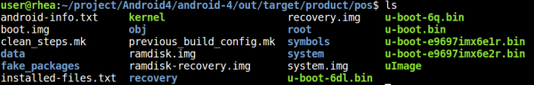

# ACP-IMX6POS Android

## Build and install Android image for ACP-IMX6POS

Here you can find instruction to setup development environment for Android source code for RSC-IMX61 and the way to install it on eMMC. With this guideline, user will be able to setup the system easily and test all the functions with the system.  

### Setup Build Environment

Please following command below to install Oracle JDK6.0 on Ubuntu 12.04 or 14.04  
```bash
$sudo apt-get install python-software-properties
$sudo add-apt-repository ppa:webupd8team/java
$sudo apt-get update
$sudo apt-get install oracle-java6-installer
$sudo update-alternatives --config java
```
Please refer to hyperlink below to setup development environment  
[Initializing a Build Environment](https://source.android.com/docs/setup/start/requirements)

### Download Source code

> [!NOTE]
> Please connect Avale FAE/Sales to get source code.

### Compile Android Source code

Please following instruction below to compile Android source code  
```bash
cd Android
./run.sh -j4
```

You can find all image files in path `Android/out/target/product/smarc/`


| Image File     | Description                       |
|:---------------|:----------------------------------|
| boot.img       | kernel image file                 |
| recovery.img   | recovery image file               |
| system.img     | system image file                 |
| u-boot-6q.bin  | bootloader for IMX6-POS Quad core |
| u-boot-6dl.bin | bootloader for IMX6-POS Dual lite |

Please copy all of them to path `Android-MfgTools\Image\smarc\android` of MfgTool folder.

### Install image

[無檔案]()

## Download MfgTool for Android from Hyperlink below

### Dual Lite version
| Image        | Download Link|
|:-------------|:-------------|
| Android6.0   | [無檔案]() |

# ACP-IMX6POS Ubuntu

## Build and install Ubuntu image for ACP-IMX6POS

Here you can find instruction to setup development environment for Ubuntu source code for ACP-IMX6POS and the way to install it on eMMC or SD card. With this guideline, user will be able to setup the system easily and test all the functions with the system.  

### Setup Build Environment

Please following command below to install Oracle JDK6.0 on Ubuntu 12.04 or 14.04  
```bash
$sudo apt-get install python-software-properties
$sudo add-apt-repository ppa:webupd8team/java
$sudo apt-get update
$sudo apt-get install oracle-java6-installer
$sudo update-alternatives --config java
```
Please refer to hyperlink below to setup development environment  
[Initializing a Build Environment ↗](https://source.android.com/docs/setup/start/requirements)

### Download Source code
> [!NOTE]
> Please connect Avale FAE/Sales to get source code.

### Compile Ubuntu Source code
Please following instruction below to compile Android source code  

#### Compile Kernel
```bash
cd linux-imx 
./run.sh e9697xxxxxx -j32 modules headers
```
#### Compile Uboot
```bash
cd uboot-imx
./run.sh e9697xxxxxx -j32 emmc
```
> [!NOTE]
> If want to flash image to SD, replace emmc to sd  

You can find Kernel image files in path `linux-imx/out`  
You can find Uboot image files in path `uboot-imx/out`  

## Install image

[無檔案]()

### Download MfgTool from Hyperlink below

#### Dual Lite version
| Image        | Download Link|
|:-------------|:-------------|
| Ubuntu12.04  | [無檔案]() |

#### Quad version
| Image        | Download Link|
|:-------------|:-------------|
| Ubuntu12.04  | [無檔案]() |

# ACP-IMX6POS Yocto

## Build and install Yocto image for ACP-IMX6POS

Here you can find instruction to setup development environment for Yocto source code for ACP-IMX6POS and the way to install it on eMMC. With this guideline, user will be able to setup the system easily and test all the functions with the system.  

### Setup Build Environment

The recommended minimum Ubuntu version is 14.04 but builds for Jethro works on 12.04 or later.Earlier versions maycause the Yocto Project build setup to fail, because it requires python versions only available starting wtih Ubuntu 12.04.A Yocto Project build requires that some packages be installed for the build that are documented under the Yocto Project.  

Essential Yocto Project host packages are:
```bash
$sudo apt-get install gawk wget git-core diffstat unzip texinfo gcc-multilib \
build-essential chrpath socat libsdl1.2-dev
```

i.MX layers host packages for a Ubuntu 12.04 or 14.04 host setup are:  
```bash
$sudo apt-get install libsdl1.2-dev xterm  sed cvs subversion coreutils texi2html \
docbook-utils python-pysqlite2 help2man make gcc g++ desktop-file-utils \
libgl1-mesa-dev libglu1-mesa-dev mercurial autoconf automake groff curl lzop asciidoc 
```
i.MX layers host packages for a Ubuntu 12.04 host setup only are:  
```bash
$sudo apt-get install uboot-mkimage 
```  
i.MX layers host packages for a Ubuntu 14.04 host setup only are:  
```bash
$sudo apt-get install u-boot-tools
```
### Download Source code
> [!NOTE]
> Please connect Avalue FAE/Sales to get source code.  

### Compile Yocto Source code
Please following instruction below to compile Ubuntu source code  

#### Compile Kernel
```bash
cd linux-imx 
./run.sh e9697xxxxxx -j32 modules headers
```
#### Compile Uboot
```bash
cd uboot-imx
./run.sh e9697xxxxxx -j32 emmc
```
> [!NOTE]
> If want to flash image to SD, replace emmc to sd  

You can find Kernel image files in path `linux-imx/out`  


You can find Uboot image files in path `uboot-imx/out`  


## Install image

[無檔案]()

### Download MfgTool for Android

#### Dual Lite version
[無檔案]()  

#### Quad version
[Yocto1.7](https://github.com/AE-public/wiki/releases/download/ACP-IMX6POS/Yocto1.7.zip)  

## Document
| Document               | Download Link|
|:-----------------------|:-------------|
| Datasheet              | [Download](https://github.com/AE-public/wiki/releases/download/ACP-IMX6POS/ACP-IMX6POS_2312423316.pdf) |
| Datasheet B1           | [Download](https://github.com/AE-public/wiki/releases/download/ACP-IMX6POS/ACP-IMX6POS-B1_2312423312.pdf) |  