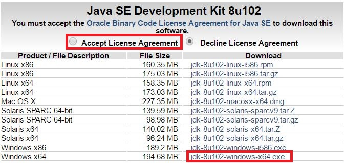
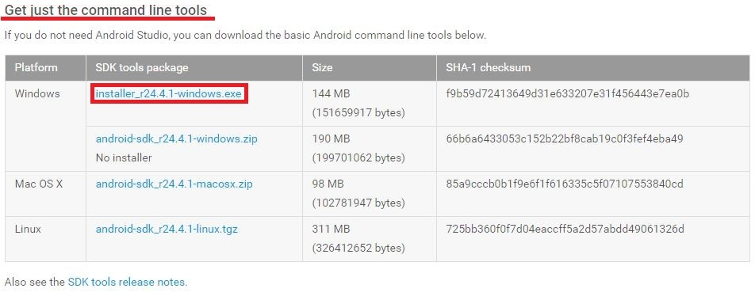
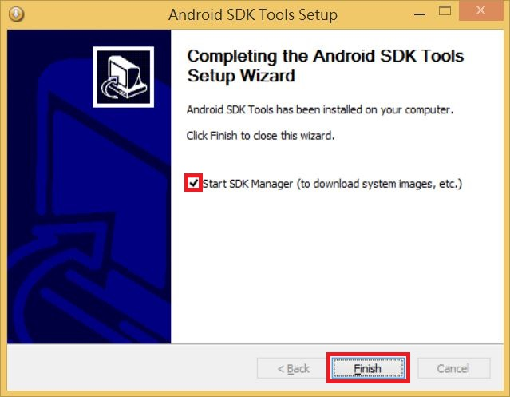
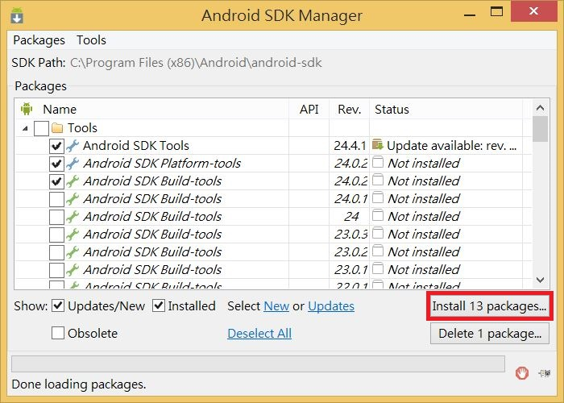
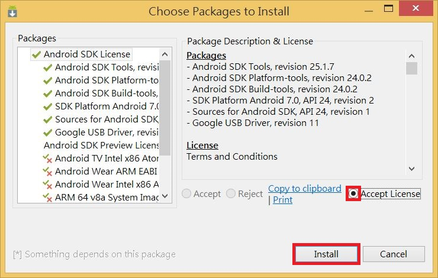
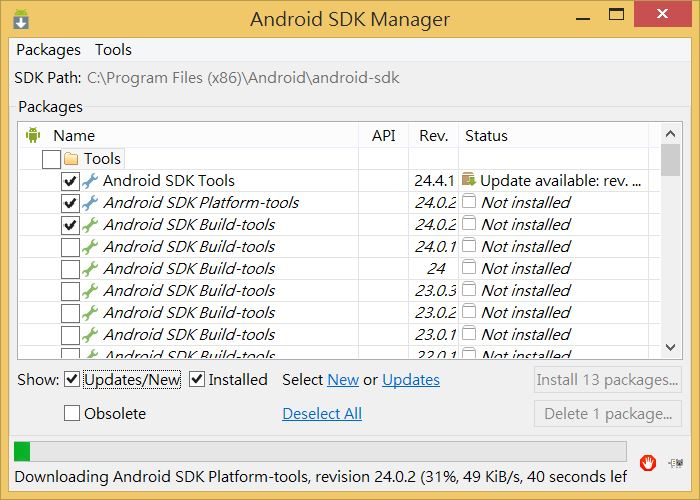
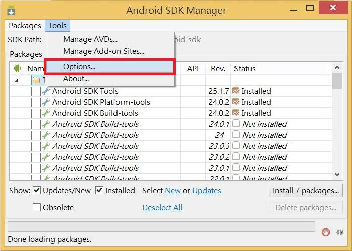
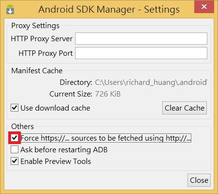
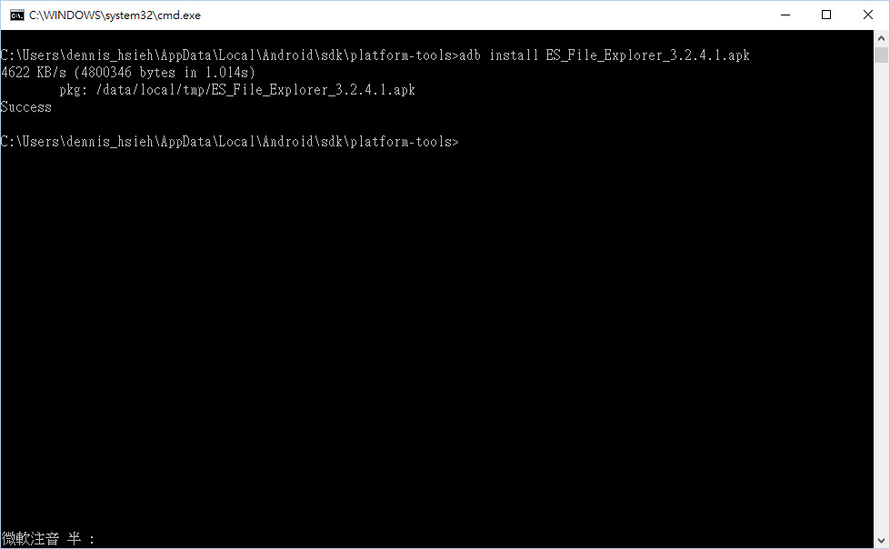

# Android APK installation for OFT PC

Here is the process to install apk file to Android in Windows environment.  

1. Please download Oracle JDK from [here ↗](https://www.oracle.com/java/technologies/downloads/#java8) and install it.
     
2. Please download Android SDK from [here ↗](https://developer.android.com/studio) and install it.  
     
3. Once you finish Android SDK installation, it will run Android SDK manager automatically. Install packages in Android SDK manager.  
     
     
     
     
   > [!NOTE]
   > If you faced difficulty fetching package from google, check the box below.  
   >  
   >  
4. Please refer to this [link](https://01.org/zh/android-ia/downloads/intel-platform-flash-tool-lite?langredirect=1) to install `Intel® Android* USB Drivers`.  
5. Now we have to run adb.exe to connect with Android. Normally you will find it in `C:\Program Fils <x86>\Android\android-sdk\platform-tools`.  
6. You will have to put apk file in platform-tools folder. Download Android file manager from [here]() and place it in the same folder of `adb.exe`.  
7. Please remember to enable Android developer mode by click `Setting⇒About tablet ⇒ Build number` several times in Android.  
8. Please enable USB debug mode by click `Setting⇒Developer options⇒USB debugging`  
9. Run command below in command prompt.  
    ```bash
    adb install xxx.apk
    ```  
      
10. Once you finish Android file manager installation, you can install any apk file by USB disk on OFT-XXW01.  
