# How to flash Android image file

## Instruction to flash Android image with USB Installer

(You can choose either this method or entering DnX Mode, instruction provided in next section)  

| Document                        | Download Link          |
| :------------------------------ | :--------------------- |
| USB installer                   | [Download]()           |
| A44_0.0.46                      | [Android image file]() |
| A44_0.0.95 (With file manager)  | [Android image file]() |
| A44_0.0.106 (With file manager) | [Android image file]() |
| A51_0.0.24                      | [Android image file]() |
| A51_0.0.39                      | [Android image file]() |  

1. Update BIOS to latest 64bit version if needed. You can refer to this link to update BIOS.  
2. Format the USB disk with FAT32, untar the `USB_Installer.7z`.  
    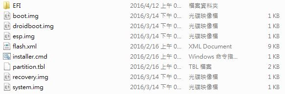  
3. Express the Android image as below.  
      
4. Express `/flash_files/build-user/byt_t_crv2_64-user-fastboot-BCXXX-VXXXX.zip`.  
    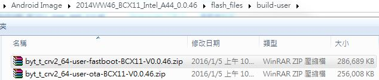  
5. Choose the actual image as below, then replace those in the USB_Installer.  
    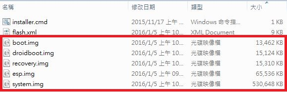  
> [!NOTE]  
> Notice that your USB_Installer should be like the file tree as below, and those redmarked ones are which you should replace with.  
> 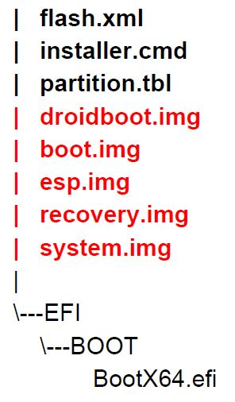  
> And your USB_Installer should be like as below.
> 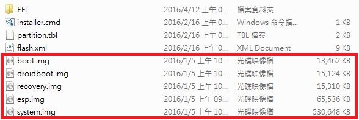  
1. Copy files under USB_Installer to your USB drive and plug in your device, and ensure that you connect keyboard with your device. 
2. Power on your device and press `F12` to enter Boot Manager, then choose the USB you plug in.
    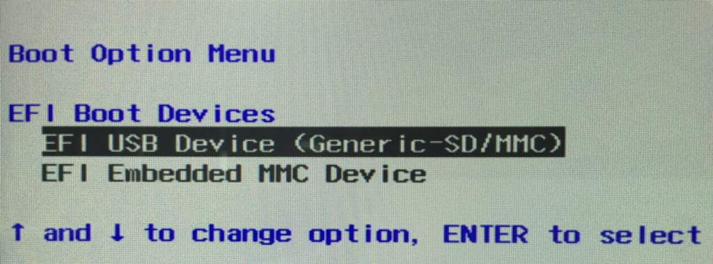
3. Auto load would start after few seconds.  
    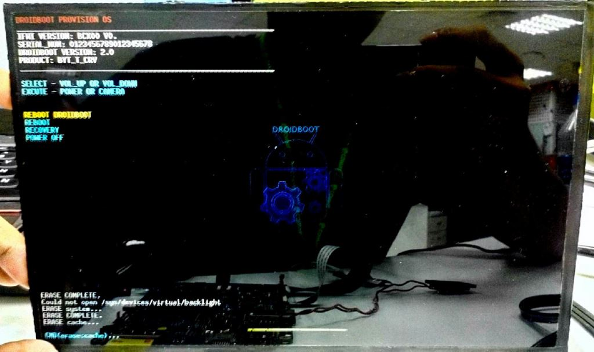  
> [!NOTE]
> Notice that you should unplug your USB while finishing loading image, or it would reload again.  
1. Reboot and enter Android system.  
    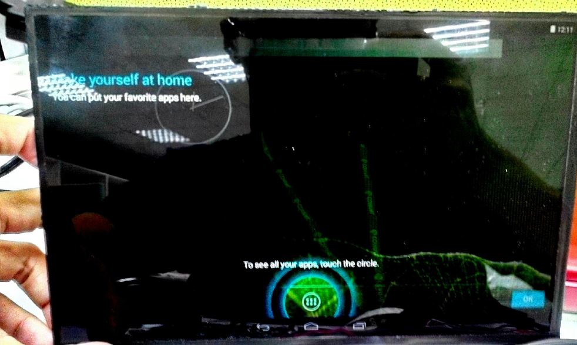  

## Instruction to flash Android image with DnX Mode

Android image file download Link  
[Android image file]()  

1. Please make sure you already update BIOS to latest 64bit version. You can refer to this link to update BIOS.  
2. Please refer to this [link]() to install `Intel Platform Flash tool Lite` and `Intel® Android* USB Drivers`.  
3. Plug in membrane keypad test cable on `JTB1` of the system. Here is approval sheet of approval sheet of [membrane keypad]() & [cable]().  
    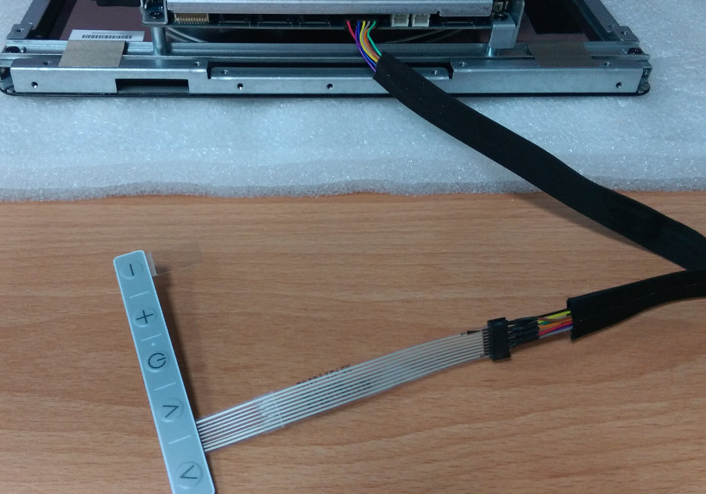  
    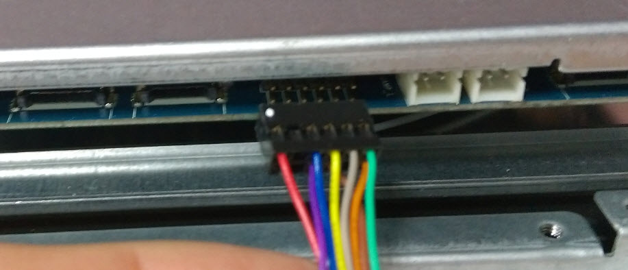  
    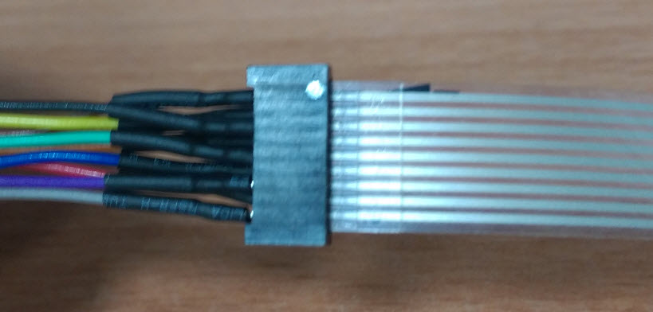  
    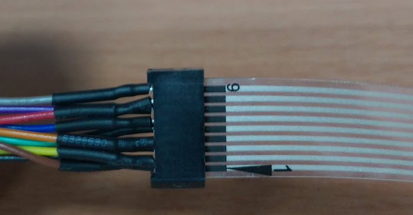  
4. Please remove all the USB devices from OFT-XXW01 before you power on the system. Press `-` & `+` key of keypad when power on to get into DNX mode. If you have problem to get into DNX mode, please reflash BIOS again to solve this issue.
    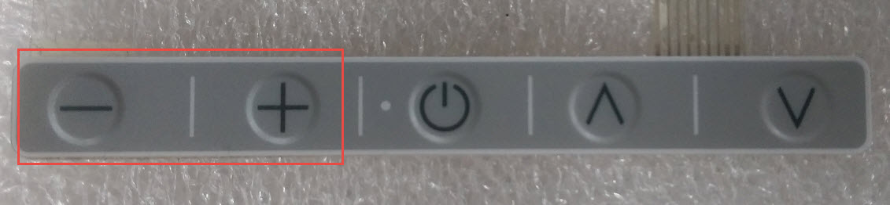  
      
5. If you do not have membrane keypad on hand, you can use the way below to get into DNX mode.  
    1. Remove shielding cover of motherboard by removing 4 screws.
        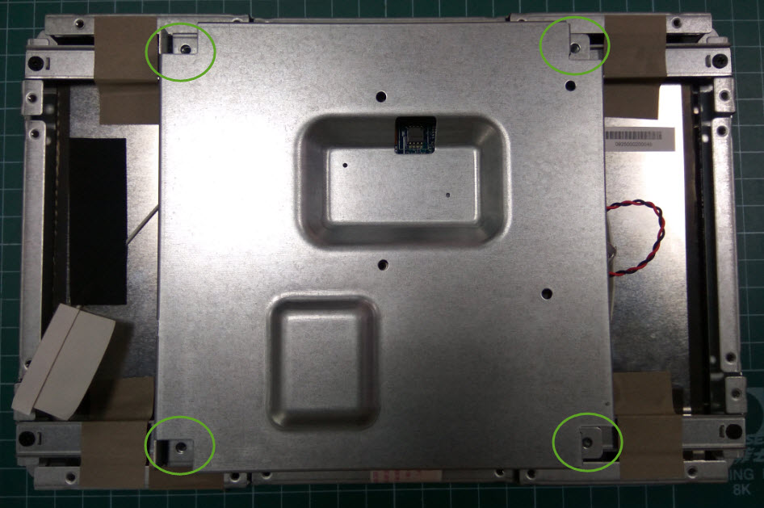  
    2. Use the 4 screws to fix motherboard well and plug in Micro USB cable.
        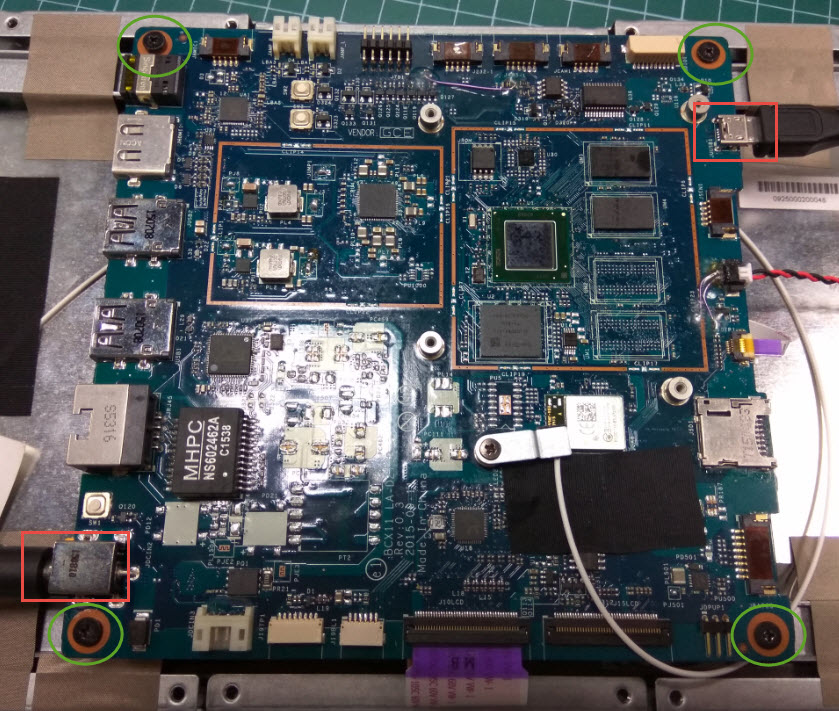  
    3. Press `SW2` before you power on the system. Power on system right now and then you will see system already in DNX mode. You can release `SW2` right now.  
        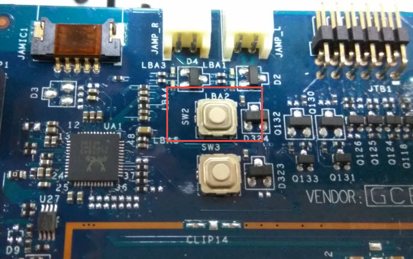  
6. Run Intel Platform Flash tool and select `flash-EraseFactory.xml` in path `\2014WW46_BCX11_Intel_A44_0.0.46\flash_files\blankphone`.  
   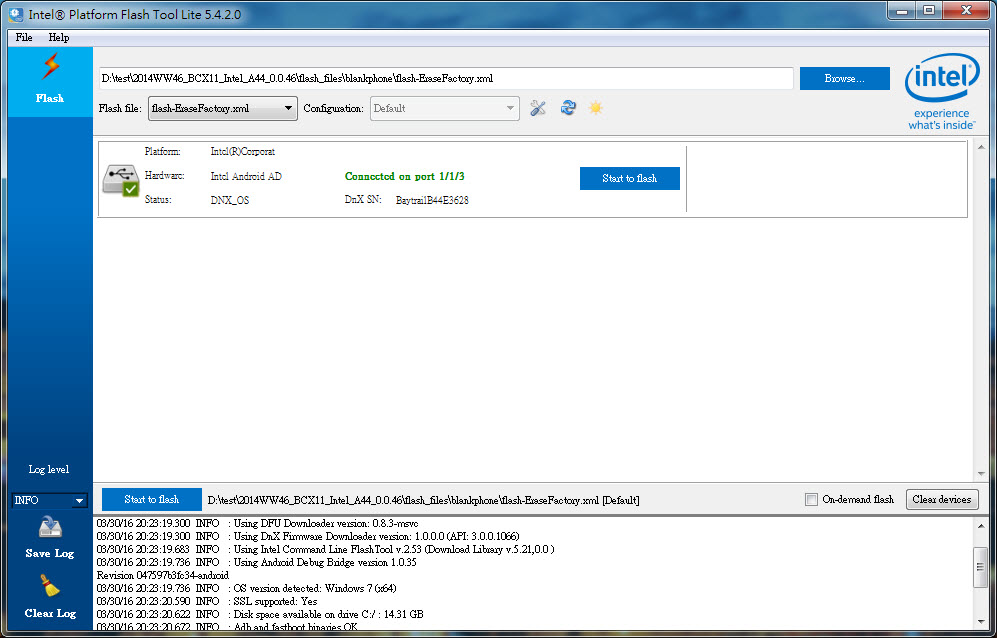  
   Press “Start to flash” to erase eMMC of the system.  
   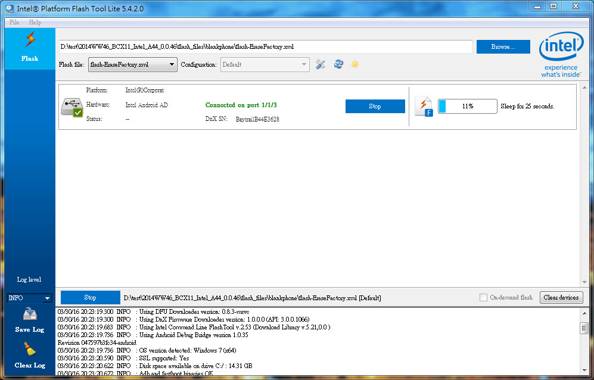  
7. Once you finish erase process, please select `flash.xml` in path `\2014WW46_BCX11_Intel_A44_0.0.46\flash_files\build-user\byt_t_crv2_64-user-fastboot-BCX11-V0.0.46` and then press `Start to flash`.
   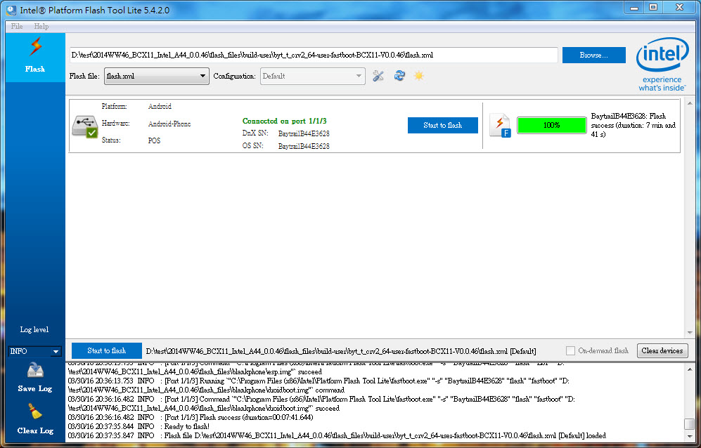  
8. Once you finish the process, OFT-XXW01 will reboot automatically and get into Android.
   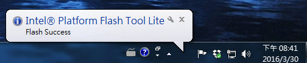  
