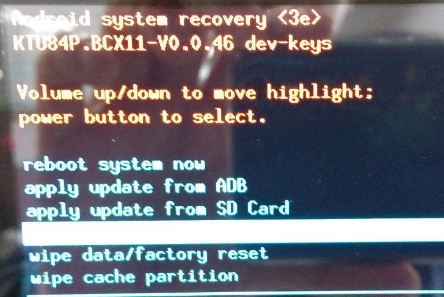
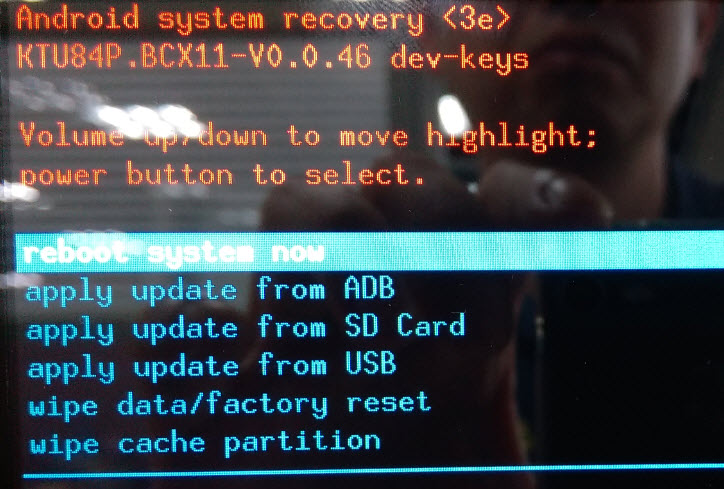

# Android OTA update process

Requested File Download Link below  
[All nedded files]()

1. Please download Android image from hyperlink above.  
2. Decompress it and you will find OTA image file `byt_t_crv2_64-ota-BCX11-V0.0.46.zip` in path `\2014WW46_BCX11_Intel_A44_0.0.46\flash_files\build-user\byt_t_crv2_64-user-ota-BCX11-V0.0.46`. Copy it to a USB disk in FAT32 format.  
3. Power on OFT-XXW01 and get into Android. You will find `Software update` in `Settings ⇒ About tablet`. Please press `reboot into recovery mode` button to get into Android recovery mode.  
4. Please select `apply update from USB` in Android system recovery menu and select OTA image file `byt_t_crv2_64-ota-BCX11-V0.0.46.zip` in USB disk.  
     
5. System will return to Android system recovery menu once finishing the process. Please select `reboot system now` to get into Android. Please note you may need to unplug USB disk before you reboot the system.
     
