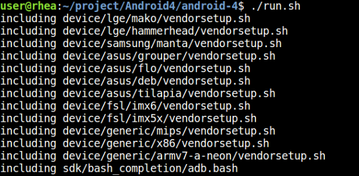
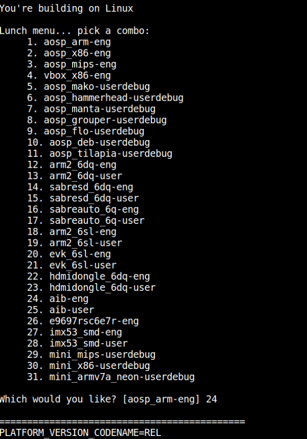
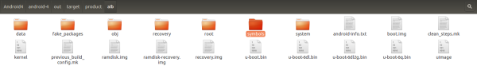

# RSC-IMX61 Android

## Build and install Android image for RSC-IMX61

Here you can find instruction to setup development environment for Android source code for RSC-IMX61 and the way to install it on eMMC or SD card. With this guideline, user will be able to setup the system easily and test all the functions with the system.  

### Setup Build Environment

Please following command below to install Oracle JDK6.0 on Ubuntu 12.04
or above.  
```bash
$sudo apt-get install python-software-properties
$sudo add-apt-repository ppa:webupd8team/java
$sudo apt-get update
$sudo apt-get install oracle-java6-installer
$sudo update-alternatives --config java
```

Please refer to hyperlink below to setup development environment  
[Initializing a Build Environment ↗](https://source.android.com/docs/setup/start/requirements)

### Download Source code
> [!NOTE]
> Please connect Avale FAE/Sales to get source code.

### Compile Android Source code

Please following instruction below to compile Android source code  

#### Compile Android image
```bash
$cd android4 
./run.sh
```
Select 24 to compile Android4.4 image  



You can find Android image files in path `linux-imx/out/target/product/aib`  


## Install image guide

[Flash image(RSC-IMX61)](https://github.com/AE-public/wiki/releases/download/RSC-IMX61/Flash.image.RSC-IMX61.pdf)

## Download MfgTool for Android from Hyperlink below

### Dual Lite version
| Image        | Download Link|
|:-------------|:-------------|
| Android6.0   | [Download](https://github.com/AE-public/wiki/releases/download/RSC-IMX61/Android6.0_Dual_Lite.zip) |  

## Document
| Documant               | Download Link|
|:-----------------------|:-------------|
| Datasheet              | [Download](https://github.com/AE-public/wiki/releases/download/RSC-IMX61/rsc-imx61.pdf) |
| Mechanical Drawing     | [Download](https://github.com/AE-public/wiki/releases/download/RSC-IMX61/rsc-imx6_150525.pdf) |
| 3D Drawing (step file) | [Download](https://github.com/AE-public/wiki/releases/download/RSC-IMX61/rsc-imx6_3d_150525.zip) |
