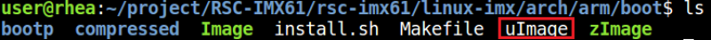
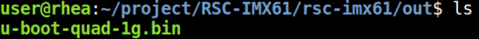

# RSC-IMX61 Ubuntu

## Build and install Ubuntu image for RSC-IMX61

Here you can find instruction to setup development environment for Android source code for RSC-IMX61 and the way to install it on eMMC. With this guideline, user will be able to setup the system easily and test all the functions with the system.  

## Setup Build Environment

Please following command below to install Oracle JDK6.0 on Ubuntu 12.04 or 14.04  
```bash
$sudo apt-get install python-software-properties
$sudo add-apt-repository ppa:webupd8team/java
$sudo apt-get update
$sudo apt-get install oracle-java6-installer
$sudo update-alternatives --config java
```
Please refer to hyperlink below to setup development environment  
[Initializing a Build Environment ↗](https://source.android.com/docs/setup/start/requirements)

## Download Source code
> [!NOTE]
> Please connect Avale FAE/Sales to get source code.

## Compile Ubuntu Source code

Please following instruction below to compile Ubuntu source code  
### Compile Kernel
```bash
$cd rsc-imx61/linux-imx
./run.sh aib-imx6 -j4
```

### Compile Uboot
```bash
$cd rsc-imx61/uboot-imx
./run.sh q-1g
```

The uboot compile parameter would be related with board version.  
| Image File | Description                |
|:-----------|:---------------------------|
| q-1g       | Quad CPU with 1G DDR3      |
| q-2q       | Quad CPU with 2G DDR3      |
| dl-1g      | Dual Lite CPU with 1G DDR3 |
| dl-2g      | Dual Lite CPU with 2G DDR3 |

You can find Kernel image in path `rsc-imx61/linux-imx/arch/arm/boot`  
  

You can find Uboot image in path `rsc-imx61/linux-imx/arch/arm/boot`  
  

## Install image guide

[User guide by MfgTool)](https://github.com/AE-public/wiki/releases/download/RSC-IMX61/Flash.image.RSC-IMX61.pdf)

## Download MfgTool for Android from Hyperlink below

### Dual Lite version
| Image        | Download Link|
|:-------------|:-------------|
| Ubuntu12.04  | [Download](https://github.com/AE-public/wiki/releases/download/RSC-IMX61/Ubuntu12.04_Dual_Lite.zip) |

### Quad version
| Image        | Download Link|
|:-------------|:-------------|
| Ubuntu12.04  | [Download](https://github.com/AE-public/wiki/releases/download/RSC-IMX61/Ubuntu12.04_Quad.zip) |

## Document
| Documant               | Download Link|
|:-----------------------|:-------------|
| Datasheet              | [Download](https://github.com/AE-public/wiki/releases/download/RSC-IMX61/rsc-imx61.pdf) |
| Mechanical Drawing     | [Download](https://github.com/AE-public/wiki/releases/download/RSC-IMX61/rsc-imx6_150525.pdf) |
| 3D Drawing (step file) | [Download](https://github.com/AE-public/wiki/releases/download/RSC-IMX61/rsc-imx6_3d_150525.zip) |
