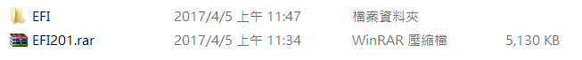
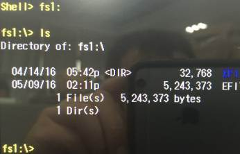

# How to update BIOS

BIOS File Download Link below  
| Version | Download Link|
| :------ | :----------- |
| v1.50   | [無檔案]() |
| v1.90   | [無檔案]() |
| v2.00   | [無檔案]() |
| v2.01   | [無檔案]() |
| v2.02   | [無檔案]() |
| v2.06   | [無檔案]() |
| v2.07   | [無檔案]() |
| v2.08   | [無檔案]() |
| v2.09   | [無檔案]() |  

Please follow procedure below to reflash BIOS :  

1. Please format a USB Disk in FAT32 format and decompress `EFI201.rar` in root directory of it.  
     

2. Plug the USB disk into USB port of OFT-XXW01 and power on the system. Please press `F12` to get into boot manager of BIOS and then choose usb boot disk as boot device.  
     

3. Once you get into EFI shell, please key in `fs1:` to get access of your USB disk.  
     

4. Please change the directory to `\EFI\boot` by command below :  
   ```bash
    cd EFI
    cd boot
   ```  
5. If you want to flash 32bit BIOS for Windows, please run command `BCX11201i32.nsh`  
6. If you want to upgrade 32bit BIOS for Windows, please run command `isflash.efi BCX11201.i32.bin -ALL`  
7. If you want to flash 64bit BIOS for Android or Linux, please run command `BCX11201x64.nsh`  
8. System will reboot automatically once you finish BIOS reflash.  
9. Please press `F2` to get into BIOS menu. Select `Exit` ⇒ `load optimal default` ⇒ `Exit Saving Changes`  
