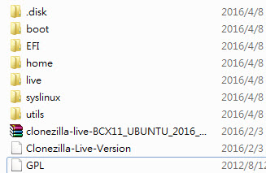
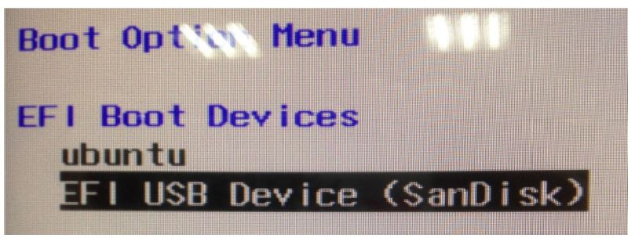
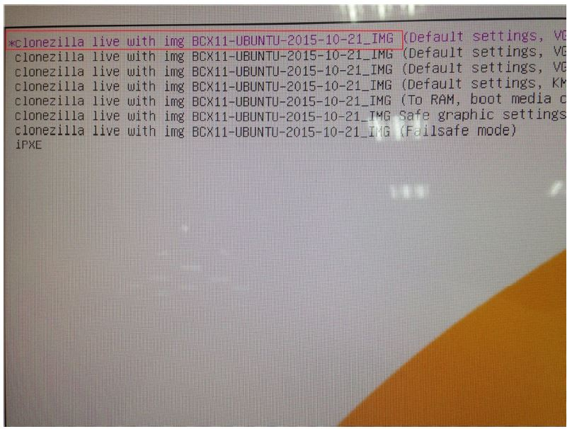
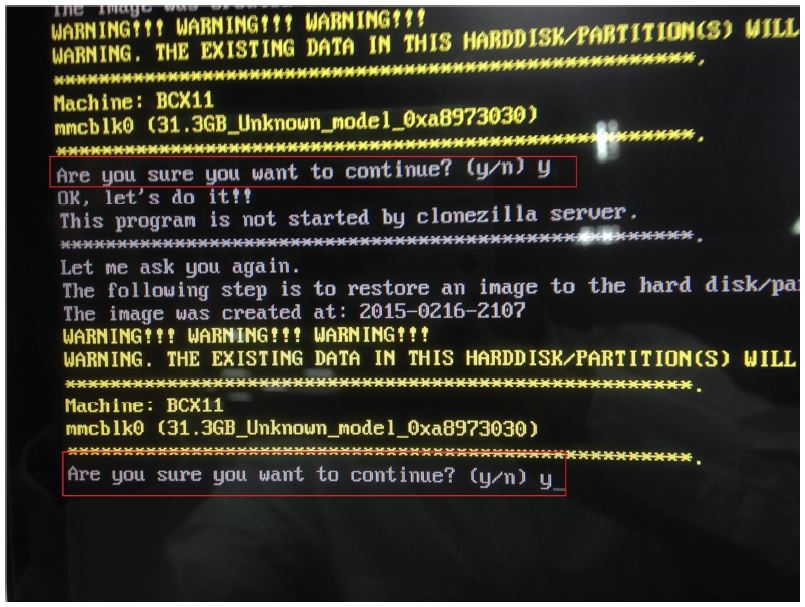
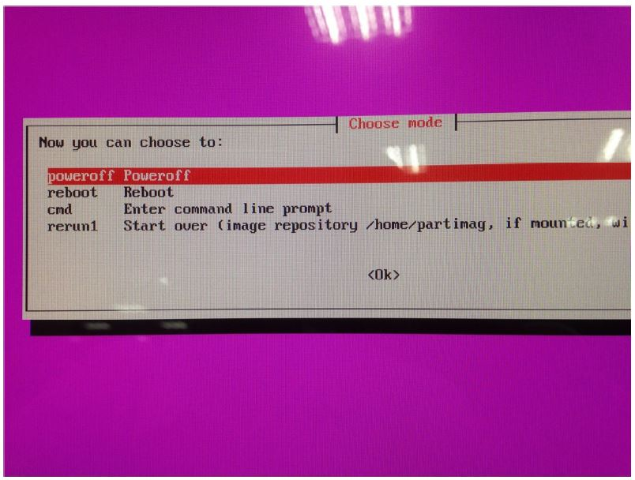
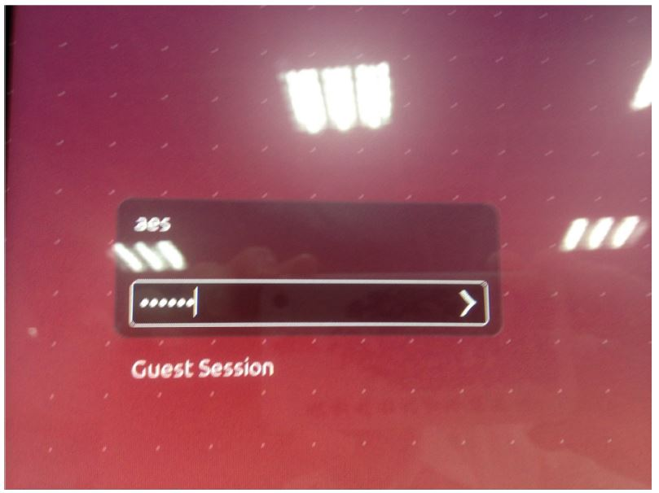

# How to flash Linux Ubuntu image file into emmc

Download Ubuntu-16.04.3-v1.0.5, please click [無檔案]() (Update on 2019/2/25)  
Download Ubuntu-16.04.3-4.5.0, please click [無檔案]() (Update on 2017/10/23)  
Please kindly download Ubuntu 14.04 64bit Clonezilla image file from [無檔案]() (Update on 2017/04/18)  
Ubuntu 16.04 64bit Clonezilla image file from [無檔案]() (Update on 2017/04/18)  

1. Get into BIOS and make sure you are using 64bit BIOS on Open Frame Tablet before staring.  
2. Please prepare a USB disk at least 16GB and format it in FAT32 format. Copy clonezilla image file to it.  
3. Decompress clonezilla image file to root directory of USB disk.  
     
4. Plug the USB disk to USB port of OFT-XXW01. Power on the system and press `F12` to get into Boot Manager of BIOS. Please select USB Disk as boot device to boot up the system.  
     
5. Please select the first option as below then press `enter`.
     
6. Please type `Y` twice to start with restore process.  
     
7. Please select `power off`. Please remove DC input and USB disk and then power on system again.  
     
8. Default user name is `aes` and password is `123456`.  
     